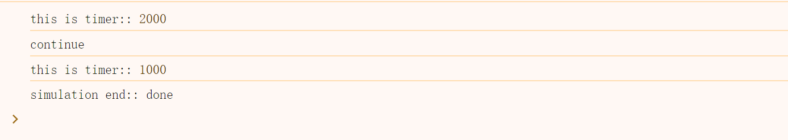

# async/await使用和实现

## async/await使用

async函数中，遇到await，会阻塞后续流程，并在await等待的promise被resolve时，再将后续流程放入微任务中等待执行；

*注意*：

1. 如果await关键词后面跟的函数，会先同步执行函数，await接受到函数返回值，此时才会运作await阻塞

2. await阻塞范围仅为**async函数中的后续流程**，async外的后续流程，在**await阻塞后**照常进行

3. async函数只有包含阻塞流程都完成后，才会返回一个promise（状态由该过程是否有抛错决定）

```js
            async function test1(){
                let res=await test3()
                //放入微任务
                console.log(1,res)
            }
            async function test3(){
                console.log('async 3')
                let res=await function test33(){
                    console.log('before await 3')
                    return setTimeout(() => {
                        console.log('timeout') //宏任务
                    }, 2000);
                }()
                //放入微任务
                console.log(3,res)
            }

            let res=test1()
            console.log('0',res)

            //console
            // async 3
            // before await 3
            // 0
            // 3
            // 1
            // timeout
```


## 生成器函数

通过function*声明，通过next()控制执行，遇到yield暂停；

每次执行会从上次暂停的地方开始；

next()会以**value**返回yield或者return表达式的值，next的参数会替换**上次yield**表达式的值；

如果遇到return或者抛错会直接结束，结束后仍然可以调用next，但不会继续上次执行，只会返回`{value: undefined, done: true}`;

即，正常一次完整执行需要调用next()次数=yield数+return

参考：[生成器函数](https://developer.mozilla.org/zh-CN/docs/Web/JavaScript/Reference/Statements/function*/) 


## async/await实现

通过生成器函数的暂停机制，再结合promise，就可以实现**async/await效果**；

```js
        function req(timer) {
            console.log('this is timer::',timer)
            return new Promise((res, rej) => {
                setTimeout(() => {
                    rej()
                }, timer)
            })
        }
	
		//通常使用async/await
        async function demo() {
            await req(2000)
            console.log('continue')
            await req(1000)
            return 'done'
        }

        demo().then((data) => { console.log('async end::', data) })

        //模拟
        function* demo2() {
            yield req(2000)
            console.log('continue')
            yield req(1000)
            return 'done'
        }

        function runner(generator) {
            let fn = generator()
            return new Promise((res, rej) => {
                function checkStatue() {
                    let { value, done } = fn.next()
                    if (done) {
                        return res(value)
                    }
                    Promise.resolve(value).then(() => checkStatue())
                }
                checkStatue()
            })
        }

        runner(demo2).then(data=>console.log('simulation end::',data))
```



这只是简单模拟。实际v8引擎处理async/await也是基于将代码转换成promise链，且做了性能优化；

v8 async/await机制详细参考：https://v8.dev/blog/fast-async

至于generator，则是通过解析语法树，根据yield划分各代码块生成状态机，同时维护一个执行指针位置和上下文匹配代码块，以此实现的代码暂停和恢复执行（协程思想的一种实现）；
