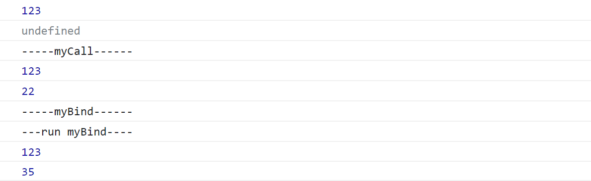

# call&&bind

call()和bind()的区别在于，call()会立即执行，bind()会返回一个新函数等待调用；

在要绑定对象上，把函数作为其新属性供其调用，达到改变函数this指向的目的；

这里只大概实现了call()/bind()改动this的效果；

```js
        Function.prototype.myCall=function(_this,...args){
            _this.fn=this
            _this.fn(...args)
        //this为当前调用myCall的上下文，这里即外部调用myCall的函数；
        //把外部函数（this）挂在指定的_this上，用新的上下文去调用
            delete _this.fn
        }

		//bind()
		//1.绑定this，返回新函数
		//2.支持多次绑定。参数会缓存，但只会在第一次绑定的this上执行
        Function.prototype.myBind=function(obj,...args){
            let _this=this
            return function(...args2){
                //多次绑定最后相当于在递归执行该部分
                obj.fn=_this
                obj.fn(...args,...args2)
                delete obj.fn
            }
        }

        function tt(arg){
            console.log(this.a)
            console.log(arg)
        }

        let obj={
            a:123
        }
        tt.call(obj)
        console.log('-----myCall------')
        tt.myCall(obj,22)
        console.log('-----myBind------')
        tt.myBind(obj,35)
        console.log('---run myBind----')
        tt.myBind(obj,35)()
```



*补充*：

call()和apply()，唯一区别在于，除了第一个参数this对象外，call()可接收多个参数，apply()接收一个数组；
