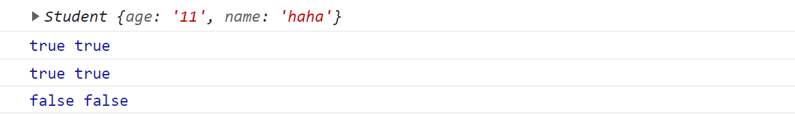

# this&&new

JavaScript中

## this

**关键字**，除了箭头函数，每个执行上下文都有一个自己的this；除了严格模式下可能为undefined，总是指向一个对象；其值在代码运行时决定；

> 严格模式下，函数中this为函数的显式调用者，隐式调用则为undefined；
> 
> ```js
> "use strict"
> function test(){
>     console.log(this)
> }
> test()        //undefined
> this.test()    //window
> ```
> 
> 使用全局对象可使用window或globalThis

变量取值由作用域确定，作用域是静态的，和代码定义位置有关，变量值只会由我们代码逻辑更改。注意this的值系统“手动”在实时赋值。继承时，函数被继承对象调用，this的取值就是当前继承对象，而不是函数定义对象；

```js
    let a=1
    function fun(){
        console.log(a) //不管怎么调用，在哪调用，始终打印1
        console.log(this.bName) //this值不确定
    }

    let pro={
        a:2,
        bName:'go',
        fun
    }

    function ttt(){
        let a=3
        this.bName='ha'

        ////a打印1,而不是3;
        // bName打印‘undefined’。此时fun的this不明确，非严格模式下会替换为全局对象。不是箭头函数不会继承ttt的this
        fun() 

        //a:1，bName:‘ha’
        fun.call(this)

        //a:1; bName:'go'
        pro.fun()
    }

    let b={
        ttt
    }

    b.ttt() 
```


## new

**运算符**，用于创建一个对象类型的实例；

> **`new`** 关键字会进行如下的操作：
> 
> 1. 创建一个空对象（即**{}**，此时对象**[[prototype]]**为Object.prototype）；
> 2. 链接原型。如果构造函数prototype是一个对象， 才赋值给步骤1对象的**[[prototype]]**；
> 3. 将构造函数**this** 指向步骤1创建的对象，在此基础上执行函数；
> 4. 如果最后函数返回值**不是对象**（包括默认的undefined），则返回**this**（自动返回）。
> 
> 参考：https://developer.mozilla.org/zh-CN/docs/Web/JavaScript/Reference/Operators/new


实现new:

```js
        function Student(name,age){
            //判断是否被new调用
            if(!(this instanceof Stu)){
                throw 'constructor Stu should be calles with "new" word'
            }

            this.age=age
            this.name=name
        }
        let stu=new Student('haha','11')
        console.log(stu)

        function newFun(constructor,...arg){
            //使用__proto__，不推荐
            // let obj={}
            // obj.__proto__=constructor.prototype

            let obj=Object.create(constructor.prototype)
            let res=constructor.call(obj,...arg)
            return typeof res==="object"?res:obj
        }
        console.log(newFun(Student,'gogo','12'))
```


## instanceof

**运算符**；用于检测**构造函数的prototype**是否出现在某个对象原型链上

实现instanceof：

```js
        function Student(name,age){
            this.age=age
            this.name=name
        }
        let stu=new Student('haha','11')
        console.log(stu)

        function instanceofFun(obj,constructor){
            //方式一：攀升原型链
            // let target=Object.getPrototypeOf(obj)
            // while(target){
            //     if(target===constructor.prototype) return true
            //     else target=Object.getPrototypeOf(target)
            // }
            // return false

            //方式二：使用方法isPrototypeOf
            return constructor.prototype.isPrototypeOf(obj)
        }
        console.log(stu instanceof Student,instanceofFun(stu,Student))
        console.log(stu instanceof Object,instanceofFun(stu,Object))
        console.log(stu instanceof Function,instanceofFun(stu,Function))
```



*补充*：

fun.isPrototypeOf（obj）：检测obj是否在**fun**的原型链上；


判断一个函数是否被new调用：

```js
//eg.在构造函数Myclass内判断
    this instanceof Myclass //new调用返回true

    //或者 
    if(!new.target) ... 
    //new调用返回当前执行的构造函数的引用
    //不是被new调用会返回undefined
```