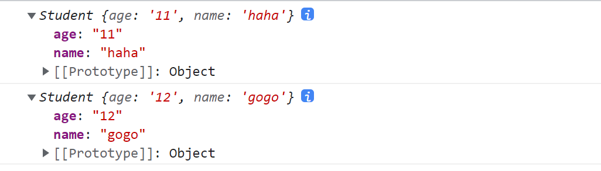

# this&&new

JavaScript中

## this

**关键字**（非变量），指当前运行环境；函数的运行环境在调用时决定；

> 严格模式下，函数中this为函数的显式调用者，隐式调用则为undefined；
>
> ```js
> "use strict"
> function test(){
>     console.log(this)
> }
> test()		//undefined
> this.test()	//window
> ```
>
> 使用全局对象可使用window或globalThis

通过this指明环境调用的变量或方法，仅在当前this环境下查找，不会攀升原型链；

同样，点语法也仅在当前环境下查找；例，a.b()，仅在a中查找方法b；


## new

**运算符**，用于创建一个对象类型的实例；

> **`new`** 关键字会进行如下的操作：
>
> 1. 创建一个空的简单JavaScript对象（即**{}**）；
> 2. 为步骤1新创建的对象添加属性**__proto__**，将该属性链接至构造函数的原型对象 ；
> 3. 将步骤1新创建的对象作为**this**的上下文 ；
> 4. 如果该函数没有返回对象，则返回**this**。
>
> 参考：https://developer.mozilla.org/zh-CN/docs/Web/JavaScript/Reference/Operators/new

**整理**：

new会先创建一个继承构造函数prototype的空对象，再执行构造函数；

构造函数会以该空对象作为其执行环境（即this）；

最后确定**构造函数**有没有返回对象，返回非对象等同于返回this；


实现new:

```js
        function Student(name,age){
            this.age=age
            this.name=name
        }
        let stu=new Student('haha','11')
        console.log(stu)

        function newFun(constructor,...arg){
            //使用__proto__，不推荐
            // let obj={}
            // obj.__proto__=constructor.prototype
            
            let obj=Object.create(constructor.prototype)
            let res=constructor.call(obj,...arg)
            return typeof res==="object"?res:obj
        }
        console.log(newFun(Student,'gogo','12'))
```



 