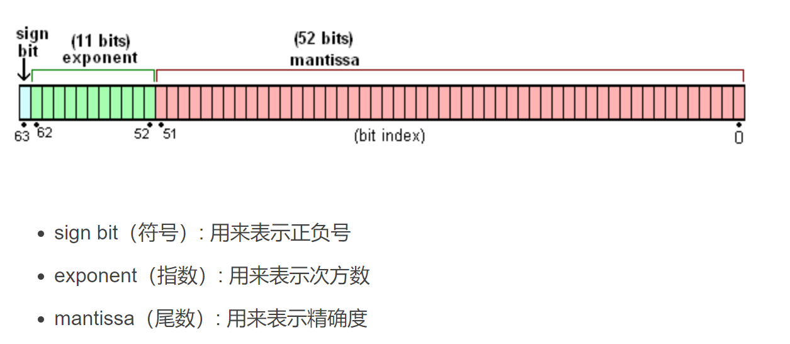

# 位运算

**注意**：==、===、!==、!===优先级均比位运算高	


- **与&**

同运算符&&，两个**位(bit)**的值都为1时，结果才为1

可用于判断奇偶：

```js
let num=7
console.log((num & 1)===1?'奇数':'偶数')
//1的二进制只有最后一位为1，其余为0
//位运算比取余运算%判断快的多；
```


- **异或  ^**

本质上为找出差异的过程，找出所有差异时，异或运算即完成。这是一个从旧信息产出新信息的过程。

由此具有以下性质：

- 任何数和 0 做异或运算，结果仍然是原来的数；a（xor）0=a
- 任何数和其自身做异或运算，结果是 0；a（xor）a=0
- 满足交换律和结合律；


异或运算可运用于去除冗余信息，数据压缩等方面，自然界中也随处可见异或运算的运用。

例：

利用异或交换a，b两个变量数据：

```js
let a=1;b=2;
a=a^b;
b=a^b;
a=a^b;//a=2,b=1
//js中可以使用更简便的解构[a,b]=[b,a]
```


## **补充点**

> - JavaScript数值类型均以64位存储浮点类型;
>
> - 位运算只对整数进行操作，非整数会装换为整数再运算；
> - JavaScript进行位运算时，先将64位**带符号浮点数**转为32位**带符号整数**计算，再转为64位浮点数返回；

​	


**Number型**

双精度64位浮点类型。遵循IEEE754规定。



注意：

- 符号位1为负；
- 实际取值范围为：-2^53 -1 ~ 2^53 -1；尾数第一位（总为1，省略，不算入浮点类型的64位）+52位尾数；通过修改指数来判断第一位是否有效（指数为53，即一共计算53位尾数）

*补充*：

浮点数用64位模拟2进制的科学计算法，尾数部分省略的第一位，即科学计数法小数点前的1，小数点后的部分则用52位来表示；

> 参考：
>
> https://www.jianshu.com/p/bc3bbdde91a2


**number转进制**：

借助方法Number.toString([radix])

同Object和Array的toString()，将目标转换为字符串；

number对象的toString()可以接收一个radix，返回按指定基数radix转换进制后的字符串；

radix默认为10

```js
(3).toString() //'3' 
(3).toString(2) //'10',3的二进制
```

*注意* ：

返回结果采用的字符串，数值没有指定开头的都会视为十进制数:

- 二进制：0b或0B开头；
- 八进制：0开头；
- 十六进制：0x或0X;
