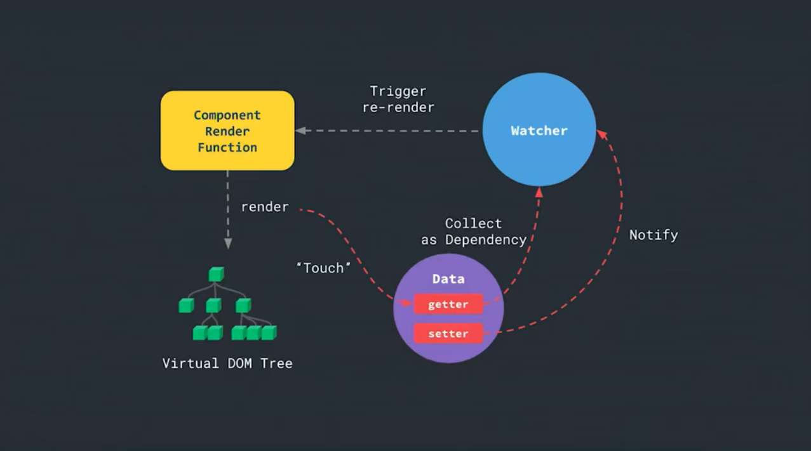

# VUE原理



响应循环：

1. render函数触发data中的变量getter；
2. getter触发watcher收集依赖；
3. data变量发生改动，通过setter触发watcher再次调动render；
4. 循环，以保持依赖追踪

render在依赖的变量每次改动时都会执行一次，通过Diff算法找出与改动前virtual DOM的区别，返回新的virtual DOM

## VUE2.X

### 响应式

基于ES5提供的**Object.defineProperty()**，覆写属性的getter和setter；

```javascript
    <script>
        //伪代码
        class VueDemo {
            constructor(){
                this.autoUpdateFun = null
            }
            observe(obj,_this=this) {
                Object.keys(obj).forEach(key => {
                    let keyValue = obj[key]
                    let dependList = new Set()
                    Object.defineProperty(obj, key, {
                        get() {
                            //收集该变量的依赖项
                            if (_this.autoUpdateFun) dependList.add(_this.autoUpdateFun)
                            return keyValue
                        },
                        set(now) {
                            keyValue = now
                            // 获取该变量所有依赖，触发更新
                            dependList.forEach(fun => {
                                fun()
                            })
                        },
                    })
                });
            }

            //autoRun：将更新函数添加到依赖项，以响应setter自动执行
            autoRun(updataFun,_this=this) {
                function autoUpdata() {
                    _this.autoUpdateFun = autoUpdata
                    updataFun()
                    //updataFun()中访问属性值，触发对应getter，将当前更新操作放入该值的依赖列表dependList
                    //得益于JS单线程特征，同一时间autoUpdateFun只为当前值。
                    _this.autoUpdateFun = null
                }
                autoUpdata()
            }
        }

    </script>
    <script>
        let state = {
            a: 1,
            b: 100
        }
        let vuedemo = new VueDemo()
        vuedemo.observe(state)

        //响应式代码块
        vuedemo.autoRun(() => {
            //该部分访问过的值（即，调用过getter），将会具有响应式特征
            console.log('this is autoRun a:', state.a)//1
        })
        state.a = 5  //触发setter，执行依赖state.a的autoRun
        console.log(state.b)
        state.b = 500 //没有对应autoRun，不具有响应式
    </script>
```

*补充*：

- autoRun()的工作实际为Vue中render函数的一部分

- autoRun()内部只能触发getter，触发setter会陷入无限循环

- autoRun()外部只会响应对应变量setter执行，不会响应getter（没有意义）

- 该例子只模拟了vue的响应式实现思路，实际还需要考虑许多边缘情况，例如深层属性的getter、setter覆写，属性的增添等；

## 异步更新

JS对DOM的更新是同步的，但浏览器对DOM的渲染是异步的；

为节省性能开销，Vue会使用一个队列，缓存**一次事件循环**中数据的修改，只将最后结果更新到DOM；

Vue通过微任务的promise.then()来判断一次事件循环进入尾声阶段；

